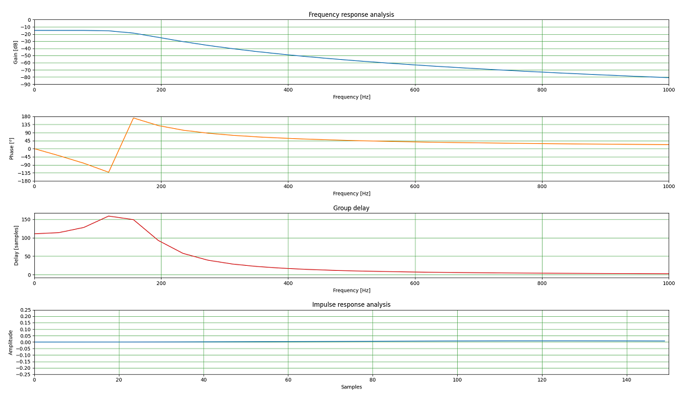
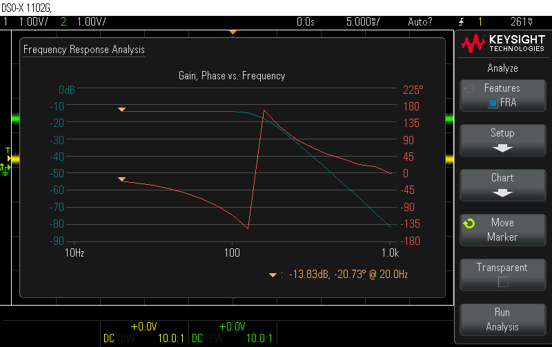

# Low level driver for TI ADS68xx (16-bit or 18-bit SPI ADC) with XMC4500

Example of low level driver for analog to digital SPI converter TI ADS68xx (16-bit or 18-bit) working with
Infineon [XMC4500][xmc4500]

---

You can easy port it to [XMC4500 RelaxKit][xmc4500_kit]
- Change I/O configuration for ADS68xx and preprocessor definition from `XMC4500_F144x1024` to `XMC4500_F100x1024` 

---

Software was written in [Dave IDE][dave_ide] and compiled by [xPack GNU Arm Embedded GCC v11.3.1-1.1][xpack]

---

### Mode of operation

There are possible two different modes of operation:

- Default mode is interrupt mode.
Start of conversion is forced by timer with sampling rate`ADS86_SAMPLING_FREQ = 100kHz`, interrupt `ADS86_Sampling_Isr`.
Rising edge at RVS pin (which means conversion is done) forces interrupt `ADS86_RVS_PIN_Isr` which triggers SPI communication.
Finish of SPI communication triggers last interrupt `ADS86_RxFifo_Isr`. Data is read and put to *DAC* output.

- Polling mode in main loop.
All triggers are done in function `ADS86XX_ServiceInPolling`.
Rising edge at ALARM pin forces interrupt which sets flag `readAdsAlarms`.
If `readAdsAlarms` is set alarm register of ADS86xx is read in function `ADS86XX_ServiceInPolling`.

---

## Tests ADS8695

Input of ADS86xx is configured as`ADS86_RANGE_SEL_BI_0_625_VREF`, so accept ± 2.56V at input. Service in ISR mode.

#### Step response

`Ch_1` input signal, `Ch_2` output signal from DAC channel 0 of XMC4500

<p align="center">  </p>

#### Frequency response analysis (oscilloscope)

<p align="center">  </p>

#### Histogram

Input of ADS86xx is configured as`ADS86_RANGE_SEL_BI_1_25_VREF`. Input signal is 0V.
Number of samples 2^16, fs = 100kHz.

<p align="center">  </p>


## Design low-pass Butterworth IIR filter

In folder *filter_py* ther is python script for design low-pass Butterworth IIR filter.

For example, 4th order low-pass Butterworth IIR filter was designed using two *Second Order Section SOS*.
Calculated coefficients for SOS section and graphs obteined from `sos_filter.py`:

```c
#ifndef SOS_COFF_H_
#define SOS_COFF_H_

#define SOS_COFF_NUM_OF_STAGES (2)

static filter_iir_2_f32_t s0 = FILTER_IIR_2_INIT(
1.86824893E-08f,
3.73649787E-08f,
1.86824893E-08f,
1.95685128E+00f,
-9.57394597E-01f);

static filter_iir_2_f32_t s1 = FILTER_IIR_2_INIT(
1.00000000E+00f,
2.00000000E+00f,
1.00000000E+00f,
1.98157908E+00f,
-9.82129258E-01f);

static filter_iir_2_f32_t * s[SOS_COFF_NUM_OF_STAGES] = {&s0, &s1};

#endif /* end of SOS_COFF_H_ */
```

#### Filter analysis graphs

<p align="center">  </p>

#### Filter frequency response analysis (oscilloscope)

<p align="center">  </p>

---

### Copyright

Copyright (C) 2023, Tomasz Osypinski. All rights reserved.

Redistribution and use in source and binary forms, with or without
modification, are permitted provided that the following conditions
are met:

1. Redistributions of source code must retain the above copyright
  notice, this list of conditions and the following disclaimer.

2. Redistributions in binary form must reproduce the above copyright
  notice, this list of conditions and the following disclaimer in the
  documentation and/or other materials provided with the distribution.

THIS SOFTWARE IS PROVIDED BY THE AUTHOR AND CONTRIBUTORS ``AS IS'' AND
ANY EXPRESS OR IMPLIED WARRANTIES, INCLUDING, BUT NOT LIMITED TO, THE
IMPLIED WARRANTIES OF MERCHANTABILITY AND FITNESS FOR A PARTICULAR PURPOSE
ARE DISCLAIMED.  IN NO EVENT SHALL THE AUTHOR OR CONTRIBUTORS BE LIABLE
FOR ANY DIRECT, INDIRECT, INCIDENTAL, SPECIAL, EXEMPLARY, OR CONSEQUENTIAL
DAMAGES (INCLUDING, BUT NOT LIMITED TO, PROCUREMENT OF SUBSTITUTE GOODS
OR SERVICES; LOSS OF USE, DATA, OR PROFITS; OR BUSINESS INTERRUPTION)
HOWEVER CAUSED AND ON ANY THEORY OF LIABILITY, WHETHER IN CONTRACT, STRICT
LIABILITY, OR TORT (INCLUDING NEGLIGENCE OR OTHERWISE) ARISING IN ANY WAY
OUT OF THE USE OF THIS SOFTWARE, EVEN IF ADVISED OF THE POSSIBILITY OF
SUCH DAMAGE.

---
See [CHANGELOG.md](./CHANGELOG.md)

[xmc4500]: https://www.infineon.com/cms/en/product/microcontroller/32-bit-industrial-microcontroller-based-on-arm-cortex-m/32-bit-xmc4000-industrial-microcontroller-arm-cortex-m4/xmc4500/#!designsupport
[xmc4500_kit]: https://www.infineon.com/cms/en/product/evaluation-boards/kit_xmc45_relax_lite_v1/
[dave_ide]: https://softwaretools.infineon.com/tools/com.ifx.tb.tool.daveide
[xpack]: https://github.com/xpack-dev-tools/arm-none-eabi-gcc-xpack/releases