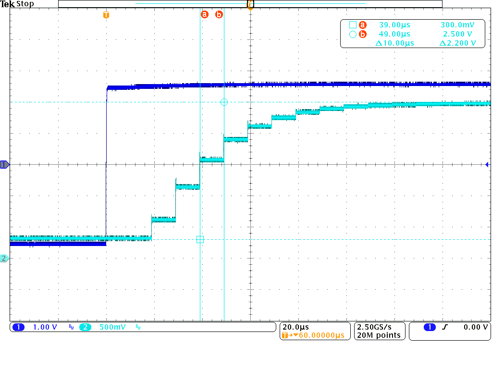
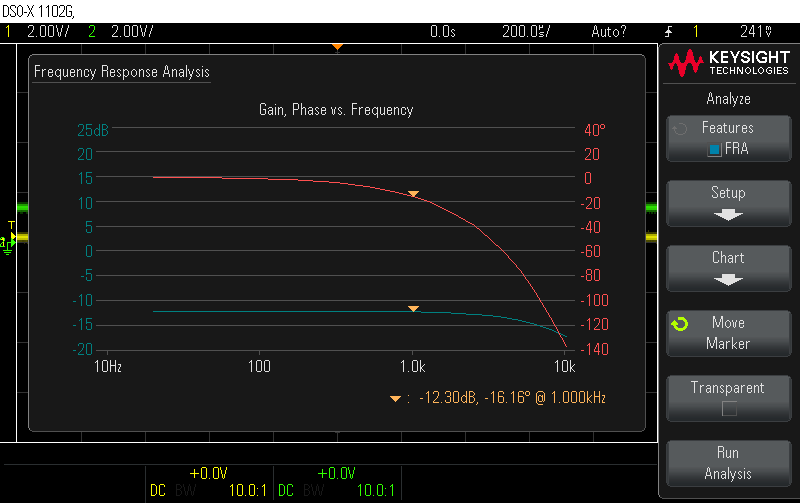
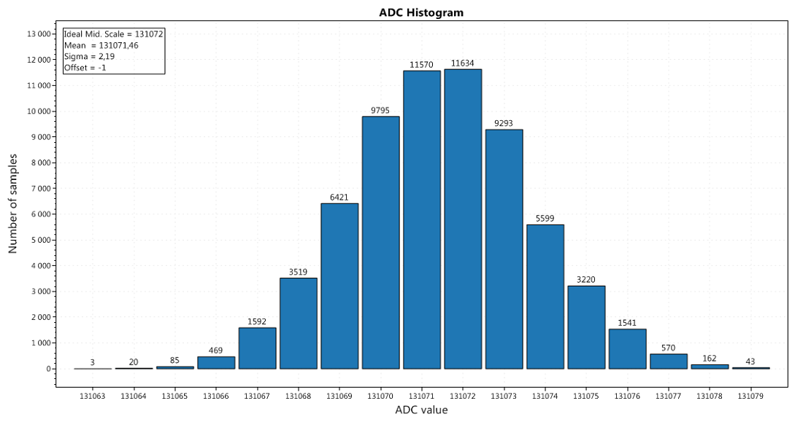

# Low level driver for ADS68xx with XMC4500

Example of low level driver for analog to digital SPI converter ADS68xx working with
Infineon [XMC4500][xmc4500]

---

You can easy port it to [XMC4500 RelaxKit][xmc4500_kit]
- Change I/O configuration for ADS68xx and preprocessor definition from `XMC4500_F144x1024` to `XMC4500_F100x1024` 

---

Software was written in [Dave IDE][dave_ide] and compiled by [xPack GNU Arm Embedded GCC v11.3.1-1.1][xpack]

---

### Mode of operation

There are possible service ADS86xx in two different modes:

- Default mode is interrupt mode.
Conversion start is forced by interrupt from *CCU81_0* timer at frequency `ADS86_SAMPLING_FREQ = 100kHz`.
Next rising edge of RVS pin (which means conversion is done) force interrupt which trigger SPI communication.
Finish of SPI communication trigger last ISR. Data is read and put to *DAC* output.

- Polling mode in main loop.
All triggers are done in function `ADS86XX_ServiceInPolling`.
Rising edge of ALARM pin force interrupt which set flag `readAdsAlarms`.
If `readAdsAlarms` is set alarm register of ADS86xx is read in function `ADS86XX_ServiceInPolling`.

---

## Tests ADS8695

Input of ADS86xx is configured as`ADS86_RANGE_SEL_BI_0_625_VREF`, so accept ± 2.56V at input. Service in ISR mode.

#### Step response

`Ch_1` input signal, `Ch_2` output signal from DAC channel 0 of XMC4500

  

#### Frequency response analysis

  

#### Histogram

Input of ADS86xx is configured as`ADS86_RANGE_SEL_BI_1_25_VREF`. Input signal is 0V.
Number of samples 2^16, fs = 100kHz.

  

---

### Copyright

Copyright (C) 2023, Tomasz Osypinski. All rights reserved.

Redistribution and use in source and binary forms, with or without
modification, are permitted provided that the following conditions
are met:

1. Redistributions of source code must retain the above copyright
  notice, this list of conditions and the following disclaimer.

2. Redistributions in binary form must reproduce the above copyright
  notice, this list of conditions and the following disclaimer in the
  documentation and/or other materials provided with the distribution.

THIS SOFTWARE IS PROVIDED BY THE AUTHOR AND CONTRIBUTORS ``AS IS'' AND
ANY EXPRESS OR IMPLIED WARRANTIES, INCLUDING, BUT NOT LIMITED TO, THE
IMPLIED WARRANTIES OF MERCHANTABILITY AND FITNESS FOR A PARTICULAR PURPOSE
ARE DISCLAIMED.  IN NO EVENT SHALL THE AUTHOR OR CONTRIBUTORS BE LIABLE
FOR ANY DIRECT, INDIRECT, INCIDENTAL, SPECIAL, EXEMPLARY, OR CONSEQUENTIAL
DAMAGES (INCLUDING, BUT NOT LIMITED TO, PROCUREMENT OF SUBSTITUTE GOODS
OR SERVICES; LOSS OF USE, DATA, OR PROFITS; OR BUSINESS INTERRUPTION)
HOWEVER CAUSED AND ON ANY THEORY OF LIABILITY, WHETHER IN CONTRACT, STRICT
LIABILITY, OR TORT (INCLUDING NEGLIGENCE OR OTHERWISE) ARISING IN ANY WAY
OUT OF THE USE OF THIS SOFTWARE, EVEN IF ADVISED OF THE POSSIBILITY OF
SUCH DAMAGE.

---
See [CHANGELOG.md](./CHANGELOG.md)

[xmc4500]: https://www.infineon.com/cms/en/product/microcontroller/32-bit-industrial-microcontroller-based-on-arm-cortex-m/32-bit-xmc4000-industrial-microcontroller-arm-cortex-m4/xmc4500/#!designsupport
[xmc4500_kit]: https://www.infineon.com/cms/en/product/evaluation-boards/kit_xmc45_relax_lite_v1/
[dave_ide]: https://softwaretools.infineon.com/tools/com.ifx.tb.tool.daveide
[xpack]: https://github.com/xpack-dev-tools/arm-none-eabi-gcc-xpack/releases